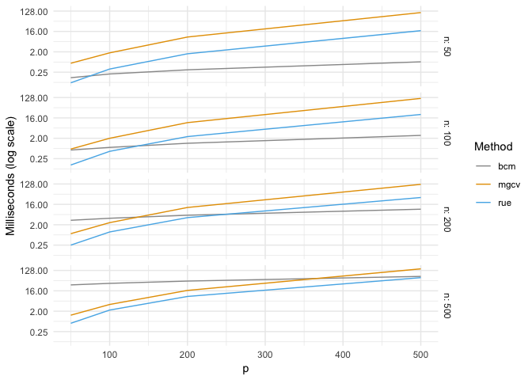

bayesnorm
=========

*Efficient sampling of normal posterior distributions*

[](https://travis-ci.org/ankargren/bayesnorm)[](https://codecov.io/github/ankargren/bayesnorm?branch=master)

About
-----

The `bayesnorm` package provides two functions, `rmvn_bcm` and `rmvn_rue`, which allow for efficient sampling from normal posterior distributions. The posterior distribution should have the form `mu = Sigma * Phi' * alpha`, where the posterior covariance matrix is `Sigma = (Phi' * Phi + D^{-1})^{-1}` and `D` is a diagonal matrix. This is the ubiquitous form of normal posteriors. It shows up in standard Bayesian linear regression as well as when using scale mixtures such as the horseshoe prior or other priors from the global-local shrinkage family. The idea of this package is to provide C++ headers so that sampling routines specifically tailored for the form of the posterior can be employed, which can speed up computations notably. The main use of the package is therefore for building and implementing Gibbs samplers. In addition to the C++ headers, simple wrappers are available for use from R directly.

Installation
------------

The package is currently GitHub only and can be installed using `devtools`:

``` r
devtools::install_github("ankargren/bayesnorm")
```

Sampling routines
-----------------

The `rmvn_bcm` is appropriate when `n<p`, whereas `rmvn_rue` is typically the faster alternative when `n>p`.

The sampling routines are based on the proposals by Bhattacharya, Chakraborty and Mallick (2016) and Rue (2001). The former is based on an idea of avoiding operations in the `p` dimension in favor of working in the `n` dimension, which is why it is preferrable when `n<p`. The latter sampling routine instead does the opposite. The Bhattacharya, Chakraborty and Mallick (2016) algorithm has complexity *O*(*n*<sup>2</sup>*p*), whereas the Rue (2001) routine has complexity *O*(*p*<sup>3</sup>).

The C++ implementations are available as headers and can therefore be called directly in C++ (e.g. via Rcpp) if necessary by other packages.

Example 1: Mean of draws
------------------------

We can first verify that the two functions draw from the correct distribution by a simple comparison with the sampling function in the `mgcv` package. First generate some toy data:

``` r
library(bayesnorm)
set.seed(10871)
X <- matrix(rnorm(1000), 50, 20)
d <- runif(20, 0, 1)
alpha <- rnorm(50)
```

Next, call the two functions a large number of times:

``` r
rue <- replicate(100000, rmvn_rue(X, d, alpha), simplify = "matrix")
bcm <- replicate(100000, rmvn_bcm(X, d, alpha), simplify = "matrix")
```

Let's also contrast these results with using an approach where we compute the posterior mean and covariance and generate from a normal distribution with mean `mu` and covariance matrix `Sigma`. The results should be the same, but it would be an inefficient way to do it.

``` r
Sigma <- solve(crossprod(X) + diag(1/d))
mu <- Sigma %*% crossprod(X, alpha)
mgcv <- mgcv::rmvn(100000,c(mu),Sigma)
```

If we now compute the mean over the draws, we can see that they are close:

``` r
cbind(rue = rowMeans(rue),
      bcm = rowMeans(bcm),
      mgcv = colMeans(mgcv))
```

    ##                rue          bcm         mgcv
    ##  [1,] -0.051665386 -0.050506259 -0.050840758
    ##  [2,] -0.108777771 -0.111043508 -0.110721733
    ##  [3,] -0.009251537 -0.009510866 -0.009484733
    ##  [4,] -0.245799604 -0.246176229 -0.244988191
    ##  [5,]  0.015503416  0.015937013  0.016012723
    ##  [6,] -0.092582750 -0.093647313 -0.091423241
    ##  [7,] -0.114602481 -0.114603507 -0.115584874
    ##  [8,] -0.239047967 -0.239518257 -0.239202218
    ##  [9,]  0.036776290  0.036206388  0.037166327
    ## [10,] -0.008249618 -0.007448558 -0.008019193
    ## [11,]  0.178470461  0.179771682  0.179340654
    ## [12,]  0.141729718  0.141786773  0.141908386
    ## [13,] -0.012537412 -0.012673768 -0.012863131
    ## [14,]  0.064166178  0.064871815  0.063416370
    ## [15,]  0.148037818  0.147134907  0.148304541
    ## [16,] -0.040774821 -0.040515076 -0.039397518
    ## [17,]  0.049774601  0.049183180  0.049634386
    ## [18,]  0.030731317  0.031099970  0.029598139
    ## [19,]  0.232294602  0.231776831  0.231537055
    ## [20,]  0.138275893  0.138062447  0.137994832

While this does not prove anything, it shows us that the means of a large number of draws using the three functions are essentially the same.

Example 2: Efficiency of sampling routines
------------------------------------------

For the second example, we can investigate what use of these two functions mean in terms of efficiency. First, we load the `bayesnorm` and `tidyverse` packages:

``` r
library(bayesnorm)
library(tidyverse)
```

    ## ── Attaching packages ──────────────────────────────────────────────────────────────────────────────── tidyverse 1.2.1 ──

    ## ✔ ggplot2 3.0.0     ✔ purrr   0.2.5
    ## ✔ tibble  1.4.2     ✔ dplyr   0.7.6
    ## ✔ tidyr   0.8.1     ✔ stringr 1.3.1
    ## ✔ readr   1.1.1     ✔ forcats 0.3.0

    ## ── Conflicts ─────────────────────────────────────────────────────────────────────────────────── tidyverse_conflicts() ──
    ## ✖ dplyr::filter() masks stats::filter()
    ## ✖ dplyr::lag()    masks stats::lag()

Next, set the seed and values of `n` and `p` to look at. The function `sample_fun()` computes the posterior mean and covariance and then makes a draw using the `mgcv::rmvn()` function.

``` r
set.seed(16379)
n_vec <- c(50, 100, 200, 500)
p_vec <- c(50, 100, 200, 500)

sample_fun <- function(X, d, alpha) {
  Sigma <- solve(crossprod(X) + diag(1/d))
  mu <- Sigma %*% crossprod(X, alpha)
  out <- mgcv::rmvn(1,c(mu),Sigma)
  return(out)
}
```

The `data.frame` `combs` stores all the combinations of `n` and `p`; we will go through its rows and fill in timings for the three sampling functions:

``` r
combs <- expand.grid(n = n_vec, p = p_vec, bcm = NA, mgcv = NA, rue = NA)
```

Finally, loop through `combs`, generate data and time the functions (NB: it takes some time):

``` r
for (i in 1:nrow(combs)) {
  n <- combs[i, 1]
  p <- combs[i, 2]
  
  X <- matrix(rnorm(n*p), n, p)
  d <- runif(p, 0, 1)
  alpha <- rnorm(n)
  mb <- microbenchmark::microbenchmark(rue = rmvn_rue(X, d, alpha),
                                 bcm = rmvn_bcm(X, d, alpha),
                                 mgcv = sample_fun(X, d, alpha), times = 1000)
  
  combs[i, 3:5] <- as_tibble(mb) %>%
    group_by(expr) %>%
    summarize(median = median(time)/1e6) %>%
    arrange(as.character(expr)) %>% 
    pull(median)
  
}
```

Before plotting, put the data into long format:

``` r
theme_set(theme_minimal())
cbPalette <- c("#999999", "#E69F00", "#56B4E9", "#009E73", 
               "#F0E442", "#0072B2", "#D55E00", "#CC79A7")
plot_df <- as_tibble(combs) %>%
  gather(bcm:rue, key = "Method", value = "Milliseconds (log scale)")
```

First, we plot the results letting the `x` axis be the number of covariates `p`. For each facet, `n` is fixed.

``` r
plot_df %>%
  ggplot(aes(x = p, y = `Milliseconds (log scale)`)) +
  geom_line(aes(color = Method)) +
  facet_grid(n~.,labeller = labeller(.rows = label_both, .cols = label_both)) +
  scale_y_continuous(trans = "log2") +
  scale_color_manual(values = cbPalette)
```



What the figure is showing is that:

1.  using the `rmvn_rue()` function, specifically tailored for this specific posterior distribution, is always better than computing `mu` and `Sigma` and then drawing from the posterior
2.  `rmvn_rue()` and `mgcv::rmvn()` are unaffected across facets, i.e. the sample size does not affect the computational time
3.  if `n` is small relative to `p`, the `rmvn_bcm()` function offers a substantial speed improvement

In the second figure, we instead fix `p` and let the `x` axis be the sample size `n`:

``` r
plot_df %>%
  ggplot(aes(x = n, y = `Milliseconds (log scale)`)) +
  geom_line(aes(color = Method)) +
  facet_grid(p~.,labeller = labeller(.rows = label_both, .cols = label_both)) +
  scale_y_continuous(trans = "log2") +
  scale_color_manual(values = cbPalette)
```


The second figure reiterates the point that you can always do better than naive sampling where `mu` and `Sigma` are computed explicitly. The take-away message is that notable speed improvements can be obtained by using one of the two sampling routines offered in the package when sampling from normal posterior distributions. If `p>n`, the `rmvn_bcm` function is the more faster alternative whereas `rmvn_rue` is faster otherwise.

Example 3: Bayesian linear regression
-------------------------------------

To see what the gains are in estimating a model, the package RcppDist provides an example of standard Bayesian linear regression. In standard Bayesian linear regression, the posterior mean and variance is constant and can be pre-computed outside of the MCMC loop. However, using scale mixtures and other hierarchical priors (e.g. normal-gamma, horseshoe, Dirichlet-Laplace, etc) the diagonal `D` matrix changes at every iteration, and as such the moments of the conditional posterior can no longer be pre-computed. To mimic this situation but without introducing unnecessary details, we will use the RcppDist linear regression example but fix the error variance to 1 and with the alteration that we compute `mu` and `Sigma` at every iteration (as you would need to do with a hierarchical prior). The RcppDist example with this modification is:

``` cpp
#include <RcppArmadillo.h>
#include <mvnorm.h>
// [[Rcpp::depends(RcppArmadillo, RcppDist)]]
// [[Rcpp::export]]
arma::mat bayeslm(const arma::vec& y, const arma::mat& x,
                   const int iters = 1000) {
  int p = x.n_cols;
  arma::vec d = arma::vec(p, arma::fill::ones); // prior variance is 1
  arma::mat xtx, Sigma, mu;
  
  // Storage
  arma::mat beta_draws(iters, p); // Object to store beta draws in
  for ( int iter = 0; iter < iters; ++iter ) {
    xtx = x.t() * x; // X'X
    xtx.diag() += arma::pow(d, -1.0); // add D^{-1}
    
    Sigma = xtx.i(); // the inverse is Sigma
    mu = Sigma * x.t() * y; // compute mu
    
    beta_draws.row(iter) = rmvnorm(1, mu, Sigma);
  }
  return beta_draws;
}
```

In the code, the diagonal of `D` is taken to be 1, implying that we have a standard normal prior on all of the regression parameters.

To see what use of the `bayesnorm` means in terms of efficiency in this situation, we can create a similar function where we use `mvn_rue()` to sample from the posterior:

``` cpp
#include <RcppArmadillo.h>
#include <bayesnorm.h>
// [[Rcpp::depends(RcppArmadillo, bayesnorm)]]
// [[Rcpp::export]]
arma::mat bayeslm_rue(const arma::vec& y, const arma::mat& x,
                       const int iters = 1000) {
  int p = x.n_cols;
  arma::vec d = arma::vec(p, arma::fill::ones);
  arma::mat beta_draws(p, iters);
  for ( int iter = 0; iter < iters; ++iter ) {
    beta_draws.col(iter) = mvn_rue(x, d, y);
  }
  return beta_draws;
}
```

We will try a sample size of 500 and 100 covariates:

``` r
n <- 500
p <- 100

X <- matrix(rnorm(n * p), n, p)
y <- matrix(rnorm(n), n, 1)

microbenchmark::microbenchmark(bayeslm(y, X), bayeslm_rue(y, X), times = 10)
```

    ## Unit: seconds
    ##               expr      min       lq     mean   median       uq      max
    ##      bayeslm(y, X) 3.225657 3.233842 3.267604 3.260592 3.294917 3.337557
    ##  bayeslm_rue(y, X) 2.826309 2.843897 2.870777 2.875996 2.889159 2.908320
    ##  neval
    ##     10
    ##     10

Using the `mvn_rue()` function yields about a modest 10% speed improvement.

If we instead study the `p>n` case, improvements are more sizable. Create the same MCMC function but now using `mvn_bcm()` for sampling:

``` cpp
#include <RcppArmadillo.h>
#include <bayesnorm.h>
// [[Rcpp::depends(RcppArmadillo, bayesnorm)]]
// [[Rcpp::export]]
arma::mat bayeslm_bcm(const arma::vec& y, const arma::mat& x,
                       const int iters = 1000) {
  int p = x.n_cols;
  arma::vec d = arma::vec(p, arma::fill::ones);
  arma::mat beta_draws(p, iters);
  for ( int iter = 0; iter < iters; ++iter ) {
    beta_draws.col(iter) = mvn_bcm(x, d, y);
  }
  return beta_draws;
}
```

Setting the sample size to 50 and keeping 100 as the number of covariates shows a more impressive improvement in computational efficiency:

``` r
n <- 50
p <- 100

X <- matrix(rnorm(n * p), n, p)
y <- matrix(rnorm(n), n, 1)

microbenchmark::microbenchmark(bayeslm(y, X), bayeslm_bcm(y, X), times = 10)
```

    ## Unit: milliseconds
    ##               expr      min       lq     mean   median       uq      max
    ##      bayeslm(y, X) 717.8725 721.5729 730.6563 722.1769 724.3650 789.9470
    ##  bayeslm_bcm(y, X) 237.4618 238.7750 245.0241 242.4934 252.7421 257.5175
    ##  neval
    ##     10
    ##     10

Incorporation into other packages
---------------------------------

To use the sampling routines in other RcppArmadillo-based packages, all that is needed is to:

-   add `bayesnorm` in the `LinkingTo` field in the `DESCRIPTION`
-   add `#include <bayesnorm.h>` at the top of the file calling the functions (or in the package's header file)
-   the C++ functions are named `mvn_bcm` and `mvn_rue`

### References

Bhattacharya, A., Chakraborty, A. and Mallick, B. (2016) Fast sampling with Gaussian scale mixture priors in high-dimensional regression, *Biometrika*, 103(4):985-991, [doi:10.1093/biomet/asw042](https://doi.org/10.1093/biomet/asw042)

Rue, H. (2001) Fast sampling of Gaussian Markov random fiels, *Journal of the Royal Statistical Society: Series B*, 63, 325-339, [doi:10.1111/1467-9868.00288](https://doi.org/10.1111/1467-9868.00288)
